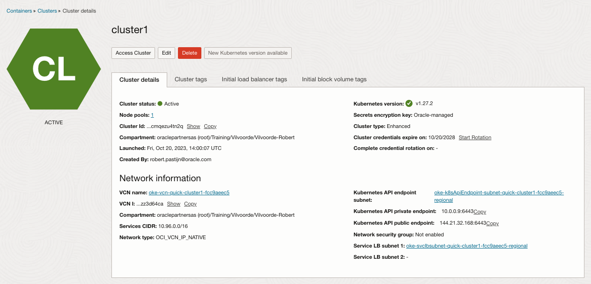

# Lab 1: Create an Arm based Kubernetes Cluster


Kubernetes, also known as K8s, is an open-source system for automating the deployment, scaling, and management of containerized applications. In order to start using Kubernetes on your private systems, you would need to download the installation software, the tools for management software, and decide on a suitable setup.

Cloud providers, like Oracle, offer out-of-the-box tested and production ready deployment methods either by running the containerized applications directly or by supplying a full blown service for the K8s installation, management, monitoring and maintenance.

Oracle OCI Cloud offers various CPU types from Intel, AMD and Arm in general and for running services like the Oracle Kubernetes Service. During this hands-on example, we will use the Arm CPU type to create a new 3 node Kubernetes cluster.

## Using the K8s Creation Wizard

### Step 1: Navigate to the K8s console page
Although you could define all services (like network, compute and storage) manually, the OCI Cloud has lots of wizards available for quick creation of services. In this example, we will use the OKE (Oracle Kubernetes Engine) Wizard.

1. On the left top of your screen, select the stacked (or hamburger menu). It is located left from the Oracle logo
2. Navigate to the Developer Services, approximately in the middle of the list
3. Navigate Kubernetes Clusters (OKE) option in the Containers & Artifacts section

Before we will create a new cluster, make sure the following items are correct, based on the hand-out that you have received for this workshop:

- Region
	- Make sure the **region** you use is correct
	- Check this on the right-top of your screen
- Compartment
	- Make sure you are in the correct **compartment**
	- The compartment can be changed using the drop-down box on the left side of your screen

### Step 2 - Start the Creation Wizard

Once you are 100% sure you have selected the correct region and compartment, click on the **create cluster** button on your screen. The following Wizard will appear:

   

In this wizard, a number of things will be done automatically:

- Create a Virtual Cloud Network (including required gateways to the internet
- Create a new Kubernetes Cluster
- Add worker-nodes (compute instances to run the containers)
- Configure the node pool for high availability of the containers

Please click on **'Submit'** to continue  

### Step 3 - Fill in the required values

Please fill in the following values:

<table>
  <tr>
    <th>Field name</th><th>Change?</th><th>Value</th><th>Remark</th>
  </tr>
  <tr><td>Name</td>
    <td><center>N</center></td><td></td><td>You could specify your own name, this example will assume 'cluster1'</td></tr>
  <tr><td>Compartment</td>
    <td><center>N</center></td><td></td><td>This should be your assigned compartment</td></tr>
  <tr><td>Kubernetes version</td>
    <td><center>N</center></td><td></td><td>Keep the default version</td></tr>
  <tr><td>Kubernetes API Endpoint</td>
    <td><center>N</center></td><td></td><td>Keep Public Endpoint</td></tr>
  <tr><td>Node type</td>
    <td><center>Y</center></td><td>Managed</td><td></td></tr>
  <tr><td>Kubernetes Worker Nodes</td>
    <td><center>N</center></td><td></td><td>Keep on Private Workers</td></tr>
   </tr>
</table>

In the Shape and Image section, we specify how many compute VMs will be part of this cluster, what type of CPU we will use, the number of CPUs per instance and the memory allocated. Please specify the following values:

<table>
  <tr>
    <th>Field name</th><th>Change?</th><th>Value</th><th>Remark</th>
  </tr>
  <tr><td>Pod shape</td>
    <td><center>Y</center></td><td>VM.Standard.A1.Flex</td><td>This means the Arm CPU type</td></tr>
  <tr><td>Number of OCPUs</td>
    <td><center>N</center></td><td></td><td>Keep on 1</td></tr>
  <tr><td>Amount of memory</td>
    <td><center>N</center></td><td></td><td>Keep on 6</td></tr>
  <tr><td>Image</td>
    <td><center>N</center></td><td></td><td>Keep on Oracle Linux 8</td></tr>
  <tr><td>Node count</td>
    <td><center>N</center></td><td></td><td>Keep on 3</td></tr>
  </tr>
</table>

When all is correct, please click on the **'Next'** button at the bottom of the page.

### Step 4: Review of the values

The last page will give you an overview of all the settings. If you are OK with them, please click **'Create Cluster'** to start running the wizard and building the cluster.

The initiation of the setup will only take a few seconds. After clicking the Create Cluster button, you will see a screen quickly initiating the setup of the various components. Wait until you see that all steps are executed correctly:

   

When you see everything 'green', click on **'Close'** to continue.

### Step 4: Checking the console page

After the Wizard page has closed, you should be redirected to the Cluster Console page:

   

Wait until the cluster has been initiated by looking at the color of the service logo (with CL in it). If the color is orange, the environment is still starting. When the color is green as in the screenshot, the services have all been started.

This does not automatically mean that all nodes are available; some of them might still be booting. Only the service has started, you might need to wait a bit before the underlying OS is available.

## Lab 2: Control your cluster using CloudShell

The easiest way to control your cluster is using a build-in terminal system in OCI. When you start a so-called cloud shell, a small image is started in the background which will give you a linux command prompt. A lot of tools are pre-installed in this shell like the tools to control your K8s cluster. The only thing needed is the configuration file with the details on how to access your cluster.

### Step 1: Setup Cloud Shell

- Click on the 'Access Cluster' button in your Cluster Console page

   
   
- Click on the **'Start Cloudshell'** button in step 1

   

- Wait until you see the prompt in your cloud shell and are able to type commands
- Copy the command from step 2 in your screen. The easiest is to click on the **Copy** link at the end of the line
- Click in your Cloud Shell and paste the command you just copied. After pressing ENTER you should see the following confirmation

     New config written to the Kubeconfig file /home/name/.kube/config

You have just created a *kubeconfig* file. Kubernetes clients like `kubectl` can work with a configuration file that facilitates access to the cluster. Such a file is generally called a *kubeconfig* file. Typically, this configuration file resides in *~/.kube*. A single configuration file can contain access configuration for multiple clusters.

### Step 2: Retrieve information using kubectl

The Kubectl application is pre-installed in the Oracle Cloud Shell for your user. Let's check if we can interact with the cluster and see the cluster nodes.

- Copy the following command to Cloud Shell and run it.
   
    ```
    <copy>kubectl get nodes -o wide</copy>
    ```

- Paste the command in the Cloud Shell and press enter. You should see output similar to the following example, depending on the number of nodes in the cluster. Note the kernel version shows that we are running Oracle Linux for `aarch64` (Arm 64-bit) architecture. 

    ```
    NAME          STATUS  ROLES  AGE  VERSION  INTERNAL-IP  EXTERNAL-IP  OS-IMAGE                  KERNEL-VERSION
    10.0.10.131   Ready   node   15m  v1.27.2  10.0.10.131  <none>       Oracle Linux Server 8.8   5.15.0-104.119.4.2.el8uek.aarch64
    10.0.10.150   Ready   node   15m  v1.27.2  10.0.10.150  <none>       Oracle Linux Server 8.8   5.15.0-104.119.4.2.el8uek.aarch64
    10.0.10.240   Ready   node   16m  v1.27.2  10.0.10.240  <none>       Oracle Linux Server 8.8   5.15.0-104.119.4.2.el8uek.aarch64
    ```

Note: If the STATUS is not READY yet, wait a couple of minutes for the setup processes to finish.

Now that you have a fully functioning Kubernetes cluster and have set up the tools to interact with it, you can deploy any Kubernetes workload to it. 

Please continue to the next section of this workshop.