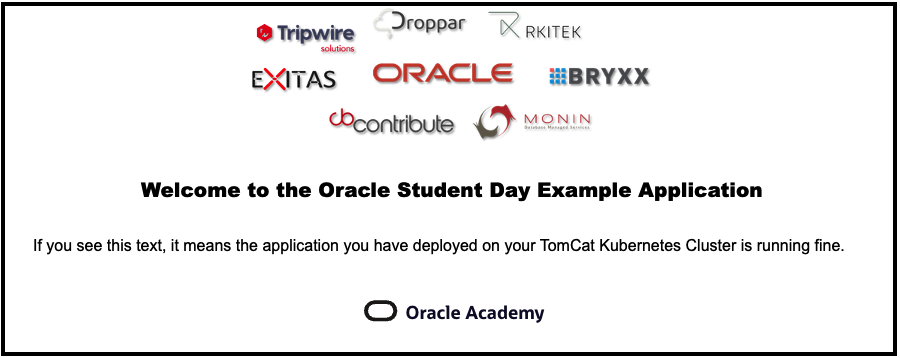
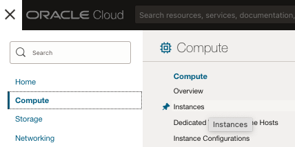
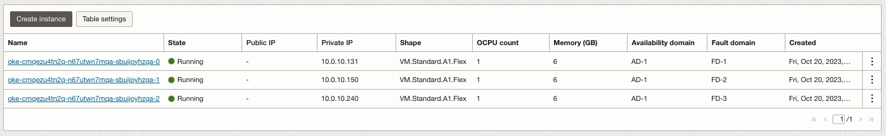
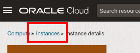

# Lab 3: Seamless deployments to your Kubernetes cluster

## Introduction

You can now deploy containerized workloads to your Arm based kubernetes cluster. Container images are built for specific architectures. Container tools such as *Docker* or *Buildah* provide the methods to manage these images and their deployment seamlessly. In this example, you will deploy Apache Tomcat, the popular Java web container to the kubernetes cluster. The docker runtime will fetch the `arm64v8` image when running on Arm and the `amd64` image when running on x86 architectures. This enables us to create seamlessly portable kubernetes deployment manifests as long as we build the application images for both architectures. 

## Step 1: Prepare the deployment

### 1.1 Download the manifest file

A manifest file tells the tool what to download and how to setup whatever you want. In this example, we will download an example manifest file into the cloud shell. Therefore, make sure you have started the cloud shell or have it running from the previous lab.

Copy the following command and execute it in your cloud shell:

    ```
    <copy>wget https://oraclepartnersas.objectstorage.eu-amsterdam-1.oci.customer-oci.com/p/nMeT3CgGmIHPo0bFoRaVQmK6gGdY--cTpS5cvgZC38zhVEU6g4XCzPMk1sjE3uc0/n/oraclepartnersas/b/OracleStudentDay08Nov/o/tomcat.yaml</copy>
    ```
  
You should see something similar to the following output:

    ```
    rp@cloudshell:~ (eu-amsterdam-1)$ wget https://oraclepartnersas.objectstorage.eu-amsterdam-1.oci.customer-oci.com/p/nMeT3CgGmIHPo0bFoRaVQmK6gGdY--cTpS5cvgZC38zhVEU6g4XCzPMk1sjE3uc0/n/oraclepartnersas/b/OracleStudentDay08Nov/o/tomcat.yaml

    --2023-10-23 13:49:45--  https://oraclepartnersas.objectstorage.eu-amsterdam-1.oci.customer-oci.com/p/nMeT3CgGmIHPo0bFoRaVQmK6gGdY--cTpS5cvgZC38zhVEU6g4XCzPMk1sjE3uc0/n/oraclepartnersas/b/OracleStudentDay08Nov/o/tomcat.yaml
    Resolving oraclepartnersas.objectstorage.eu-amsterdam-1.oci.customer-oci.com (oraclepartnersas.objectstorage.eu-amsterdam-1.oci.customer-oci.com)... 134.70.104.1
    Connecting to oraclepartnersas.objectstorage.eu-amsterdam-1.oci.customer-oci.com (oraclepartnersas.objectstorage.eu-amsterdam-1.oci.customer-oci.com)|134.70.104.1|:443... connected.
    HTTP request sent, awaiting response... 200 OK
    Length: 738 [application/x-yaml] 
    Saving to: ‘tomcat.yaml.1’

    100%[==========================================================================================>] 738         --.-K/s   in 0s      

    2023-10-23 13:49:45 (86.4 MB/s) - ‘tomcat.yaml.' saved [738/738]
    ```
The file has the following contents:

    ```
    $ <copy>cat tomcat.yaml</copy>

    apiVersion: apps/v1
    kind: Deployment
    metadata:
      name: tomcat
      labels:
        app: tomcat
    spec:
      replicas: 3
      selector:
        matchLabels:
          app: tomcat
      template:
        metadata:
          labels:
            app: tomcat
        spec:
          containers:
            - name: tomcat
              image: tomcat:9
              ports:
                - containerPort: 8080
              volumeMounts:
                - name: app-volume
                  mountPath: /usr/local/tomcat/webapps/
          volumes:
            - name: app-volume
              configMap:
                name: app-bundle
    ---
    apiVersion: v1
    kind: Service
    metadata:
      name: tomcat
      labels:
        app: tomcat
    spec:
      ports:
      - port: 80
        name: http
        targetPort: 8080
      selector:
        app: tomcat
      type: LoadBalancer
      ```
    
  This manifest contains the following objects and actions :

  - A deployment object with the name `tomcat` and label `app: tomcat`. 
  - The deployment has 3 replicas.
  - The pods in the deployment have a single container - `tomcat:9`. Note that the manifest does not specify the architecture, making it valid across all architectures. Docker will pull the image that supports the appropriate architecture at runtime. 
  - A *Volume* object is created from a *ConfigMap*, and mounted in to the container. This ConfigMap will be created later, and will contain the application.
  - The manifest also contains a Service object, and exposes the deployment over a LoadBalancer. 

### 1.2 Download a sample application

To have something to work with inside the Tomcat webserver, we can download a sample application and use this to demonstrate the working of the cluster. In the manifest we downloaded just earlier, a section specifies that a volume should be mounted that has as source a configMap called app-bundle. We first need to create this configMap and the application it points to.

Copy and paste the following command and execute it in the cloud shell to download the sample application called `studentday.war`:

    ```
    <copy>wget -nv https://oraclepartnersas.objectstorage.eu-amsterdam-1.oci.customer-oci.com/p/8S67bB6MGxCiSdQ0uqY7NmAw5m8JAoX7UlmaIhMYIDCBaLkH9q9ELEyKupDRmH7P/n/oraclepartnersas/b/OracleStudentDay08Nov/o/studentday.war</copy>
    ```

After downloading the file, we can create the so-called ConfigMap where we store additional instructions or configuration information, like the fact that we want to deploy our demo studentday.war to the generic tomcat installation. Be aware, this way of deploying an application is for convenience only, and should not be used in production.

Copy the below command and execute it in the cloud shell:

    ```
    $ <copy>kubectl create configmap app-bundle --from-file studentday.war</copy
    ```

### 1.3 Check status before deployment

At this moment, we have only build our Kubernetes cluster with 3 nodes. Nothing is deployed yet and no applications are being serviced from the K8s cluster. You can check the current status by copying the following command and pasting it in the cloud shell:

    ```
    $ <copy>kubectl get deploy,svc</copy>
    
    NAME                 TYPE        CLUSTER-IP   EXTERNAL-IP   PORT(S)             AGE
    service/kubernetes   ClusterIP   10.96.0.1    <none>        443/TCP,12250/TCP   1h
    ```

The output indicates there are no deployments (= applications) running on this cluster. In the next step, we will deploy Tomcat to the cluster.    
    
## Step 2: Deploy the manifest    

We now have the manifest (tomcat.yaml) and the configMap it refers to (app-bundle). We can now deploy the manifest to the Kubernetes cluster. This creates the kubernetes objects, including the Deployment and the Service. When creating the deployment the docker runtime will detect its running on the arm architecture and automatically pick the Arm variant of the Apache Tomcat container. The Java application is then deployed on the container, is platform neutral and hence the same `.war` file can be deployed across all architectures.

### 2.1 Apply the manifest using Kubectl

Copy the below command (and paste it in the cloud shell) to start deploying the manifest to our Kubernetes cluster:
    
      ```
      $ <copy>kubectl apply -f tomcat.yaml</copy>
      
      deployment.apps/tomcat created
      service/tomcat created
      ```

### 2.2 Check the deployment status

It takes a few minutes to deploy Tomcat and the applications over the nodes in the cluster. You can check the status of the deployment by copying and pasting the following command in the cloud shell:
   
      ```
      $ <copy>kubectl get deploy,svc</copy>

      NAME                     READY   UP-TO-DATE   AVAILABLE   AGE
      deployment.apps/tomcat   2/2     2            2           9s

      NAME                 TYPE           CLUSTER-IP      EXTERNAL-IP       PORT(S)        AGE
      service/kubernetes   ClusterIP      10.96.0.1       <none>            443/TCP        3d9h
      service/tomcat       LoadBalancer   10.96.120.212   <pending>   80:32547/TCP         9s
      ```

While you see 'PENDING' in the external-ip for the service/tomcat, you cannot access the cluster as it is still being configured. Wait (and repeat the command) until you see an external IP adress appear:

    ```
    NAME                     READY   UP-TO-DATE   AVAILABLE   AGE
    deployment.apps/tomcat   3/3     3            3           2m1s

    NAME                 TYPE           CLUSTER-IP      EXTERNAL-IP       PORT(S)             AGE
    service/kubernetes   ClusterIP      10.96.0.1       <none>            443/TCP,12250/TCP   3d
    service/tomcat       LoadBalancer   10.96.122.152   158.101.205.139   80:31790/TCP        2m
    ```

This shows that Tomcat has been deployed successfully on our Arm based kubernetes cluster and is serving a Java web application. The deployment manifest we used is not tied to the architecture, and can be used for x86 as well as Arm based clusters. 

## Step 3: Test the deployed application

When the external IP address for the LoadBalancer is available (this could take a couple of minutes) you can visit the deployment by pointing your web browser to `http://<your_loadbalancer_ip_address>/studentday`. 

If all went well, the following screen should be visible in your browser:

   

If you see this screen, congratulations, you have succesfully deployed the application on your Tomcat server running in your Kubernetescluster on Oracle Cloud Infrastructure.

## Step 4: Fail-over capabilities of the K8s cluster

At this moment, the K8s cluster has 3 nodes or VMs at its disposal to run our Tomcat server and application. What will happen if one or more of our nodes are down for maintenance or because of an issue. In this final step, we will simulate downtime and see what the consequences are for our webservice.

### 4.1 Check the current status of the nodes

We can see these nodes by executing the following command on the cloud shell:

    ```
    $ <copy>kubectl get node</copy>
    
    NAME          STATUS   ROLES   AGE   VERSION
    10.0.10.131   Ready    node    3d    v1.27.2
    10.0.10.150   Ready    node    3d    v1.27.2
    10.0.10.240   Ready    node    3d    v1.27.2
    ```
As you can see, all nodes are ready and servicing the cluster.

### 4.2 Check the current status in the OCI console
    
We can also see those nodes if we navigate in the OCI Cloud Console to the instances section. For this, do the following:

- Click on the Stacked (or Hamburger) menu, the left top of the screen next to the Oracle logo
- Select 'Compute', second entry from the top
- In the menu for Compute, select 'Instances' to show the running instances

   
   
A screen similar to the following will be visible:

   
   
When you click on an instance, you have the option to turn off the compute instance. To see the effect, first start some monitoring on the cloud shell to see the effect on the shutdown and restart.

### 4.3 Start simple monitoring of our service

Copy the following command and paste it into the cloud shell but **DO NOT EXECUTE IT YET**:

    ```
    $ <copy>watch -n5 "curl -sSf http://**your_ip_address**/studentday/ >/dev/null ; kubectl get node"</copy>
    ```
    
Before executing the statement, replace the section with **your_ip_address** with the IP address of your cluster, the one you used in your browser to check the application. If you have replaced it, a similar output should be visible:

   ```
   Every 5.0s: curl -sSf http://your_ip_address/studentday/ >/dev/null ; kubectl get node

   NAME          STATUS  ROLES   AGE     VERSION
   10.0.10.131   Ready   node    1h10m   v1.27.2
   10.0.10.150   Ready   node    1h10m   v1.27.2
   10.0.10.240   Ready   node    1h10m   v1.27.2
   ```
   
Here you see the status of the 3 nodes as the Kubernetes cluster reports them. We can now proceed to shutdown nodes and see the result.

### 4.4 Shutdown a physical node

In the OCI console where the instances are listed, click on an instance to get to the detailed overview for that node. After this, click on the 'STOP' button and select that you want to **force stop** the instance. This way we simulate a shutdown due to a crash or a network issue.

- Click on 'Stop Instance' to continue.

In the OCI console screen, the logo with the 'I' will turn from green to red indicating the physical node is not shutdown. The result of this shutdown is not visible immediately in our cloud shell as the Kubernetes cluster first needs to notice that the node is not responding anymore.

After a few seconds, you will see the status of one of your nodes changing from 'Ready' to 'NotReady':

    ```
    Every 5.0s: curl -sSf http://your_ip_address/studentday/ >/dev/null ; kubectl get node
    Tue Oct 24 13:26:31 2023

    NAME          STATUS     ROLES   AGE     VERSION
    10.0.10.131   NotReady   node    3d23h   v1.27.2
    10.0.10.150   Ready      node    3d23h   v1.27.2
    10.0.10.240   Ready      node    3d23h   v1.27.2
    ```

We do not see an error yet with the `curl` command, the command that checks whether or not there is an issue with the webservice. You can check that the service is still alive by refreshing your browser.

### 4.5 Shutdown of a second physical node

Since all is still running fine, we can continue to shutdown a second physical node using the OCI Console. Click on the `Instances` node in the Breadcrump section on top of your screen:

   
   
This takes you back to the list of instances in your compartment. Select the second instance and stop this instance the same way you did with the previous node. After a while the following output is seen in your cloud shell:

    ```
    Every 5.0s: curl -sSf http://your_ip_address/studentday/ >/dev/null ; kubectl get node
    Tue Oct 24 13:26:31 2023

    NAME          STATUS     ROLES   AGE     VERSION
    10.0.10.131   NotReady   node    3d23h   v1.27.2
    10.0.10.150   NotReady   node    3d23h   v1.27.2
    10.0.10.240   Ready      node    3d23h   v1.27.2
    ```
   
Still, we do not see any issues with our curl command which means our cluster is still servicing our application. You can check this, if you want to, by refreshing the browser where our demo application is running.

### 4.6 Shutdown the last node in the cluster

Go ahead and shutdown the third node of the cluster using the same steps as before. After a few seconds, you will see an error from the curl command in your output:

    ```
    Every 5.0s: curl -sSf http://your_ip_address/studentday/ >/dev/null ; kubectl get node
    Tue Oct 24 13:26:31 2023
    
    curl: (56) Recv failure: Connection reset by peer
    NAME          STATUS     ROLES   AGE     VERSION
    10.0.10.131   NotReady   node    3d23h   v1.27.2
    10.0.10.150   NotReady   node    3d23h   v1.27.2
    10.0.10.240   Ready      node    3d23h   v1.27.2
    ```

The error from Curl could even be quicker than the detection from Kubernetes that the third node is down too. In the end, you will see the following output:


    ```
    Every 5.0s: curl -sSf http://your_ip_address/studentday/ >/dev/null ; kubectl get node
    Tue Oct 24 13:26:31 2023
    
    curl: (56) Recv failure: Connection reset by peer
    NAME          STATUS     ROLES   AGE     VERSION
    10.0.10.131   NotReady   node    3d23h   v1.27.2
    10.0.10.150   NotReady   node    3d23h   v1.27.2
    10.0.10.240   NotReady   node    3d23h   v1.27.2
    ```

Again, you can check in your browser for any issues. Very likely that you will get an error.

### 4.7 Startup all nodes

Please startup all nodes again. You can either startup only one node and see the result or you can startup all nodes at the same time. In the end, the first moment a node becomes available, your error in the cloud shell will disappear and the application will be available in your browser again.

A small note: The fact the the OCI console reports that a physical node is running again only means it is past the BIOS startup sequence, not that it is ready for action. It usually takes between 1-3 minutes before the node can service applications again. Keep an eye on the output of the cloud shell; the moment the curl error is gone and one or more nodes are in the state 'Ready' again is when your application will be available in your browser.

## Acknowledgements

- **Initial Author** - Jeevan Joseph
- **Initial Contributors** - Orlando Gentil, Jeevan Joseph
- **Adopted and expanded for Oracle Student Day** - Robert Pastijn
- **Last Updated By/Date** - Robert Pastijn, October 2023

**End of the lab**