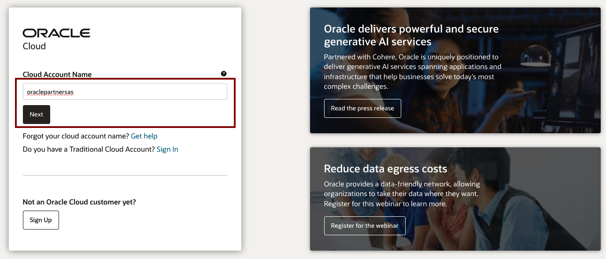
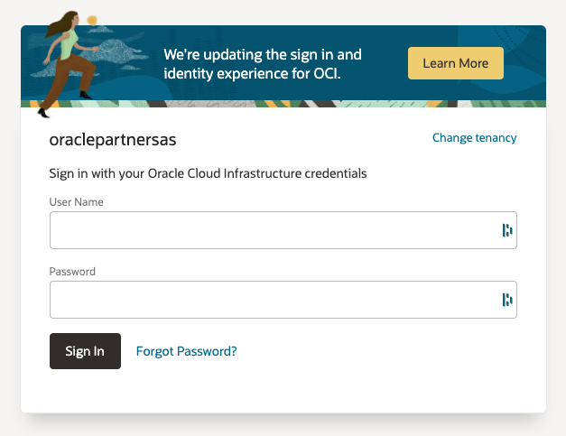
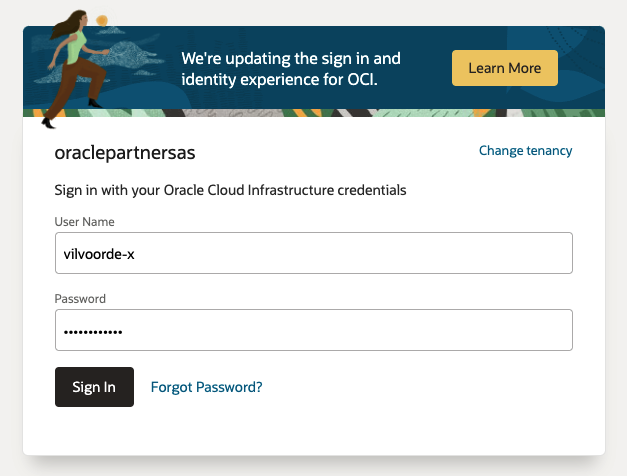

# Get started - Cloud login

## Introduction

Oracle Cloud is the industry's broadest and most integrated cloud provider, with deployment options ranging from the public cloud to your data center. Oracle Cloud offers best-in-class services across Software as a Service (SaaS), Platform as a Service (PaaS), and Infrastructure as a Service (IaaS).

Estimated Time: 5 minutes

### Types of Cloud Accounts

**We offer two types of Cloud Accounts open to everyone**:

*Free Tier Accounts*:  After you sign up for the free [Oracle Cloud promotion](https://signup.cloud.oracle.com) or sign up for a paid account, you’ll get a welcome email. The email provides you with your cloud account details and sign in credentials.

*Oracle Cloud Paid Accounts*:  When your tenancy is provisioned, Oracle sends an email to the default administrator at your company with the sign-in credentials and URL. This administrator can then create a user for each person who needs access to the Oracle Cloud. Check your email or contact your administrator for your credentials and account name.

Oracle Academy provides cloud accounts for its members and students:

*Oracle Academy Cloud Program*: The Oracle Academy Cloud Program provides access to Oracle Cloud Free Tier to Oracle Academy Institutional members and their students for teaching, learning, and developing in the cloud. Member educators and their higher education students can access always-free Oracle Autonomous Database, Compute Virtual Machines (VM), object storage, data egress, and other essential building blocks needed to create applications on top of Oracle Autonomous Databases. For more information on how to acquire a free account, please visit [the Oracle Academy Cloud Program page](https://academy.oracle.com/en/solutions-cloud-program.html).

### Objectives

- Learn how to log in to your Oracle Cloud Account

### Prerequisites
- Cloud Account Name (tenancy name)
- Username
- Password

## Task 1:  Log in to Oracle Cloud
Use the folowing steps to sign in (again) to your Oracle Cloud account.

1. Go to [cloud.oracle.com](https://cloud.oracle.com) and enter your tenancy or Cloud Account Name and click **Next**.

    
    
    In a regular cloud environment, multiple sign-in options exist. In this training environment, only one sign-on option is available. The following screen should be visible.

        

2. Enter your Cloud Account credentials and click **Sign In**. Your username and password are specified on the hand-out. 

    

3. After verification, you will be signed in to Oracle Cloud!

    

You may now **proceed to the next lab**.

## Acknowledgements
- **Created By/Date** - Anoosha Pilli, Database Product Management, August 2023
- **Contributors** - John Peach, Kamryn Vinson, Kay Malcolm, Rene Fontcha, Madhusudhan Rao, Arabella Yao
- **Last Updated By** - Robert Pastijn, Database Product Management, October 2023